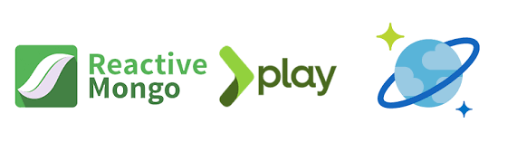

# 

### A Sample application built with Play framework integrated with Reactive Scala Driver for Mongo DB and Azure CosmosDB
This codebase demonstrates the following capabilites:
* Scala Play 2.7 - MVC, Dependency Injection etc
* Akka HTTP server backend
* Calling REST APIs with Play WS
* Reactive Scala Driver for Mongo DB
* Using Cosmos DB Mongo API from Reactive Scala Driver 

# Getting started

## First install:
 * Java 8
 * sbt

## Then:
* Create Cosmos DB Mongo collection
* Update the following properties in application.cong for PlayScalaReadingListWebApp 
  - mongoConfig.collection
  - mongodb.uri
* sbt "run 9001" - from PlayScalaRecommendationService the to start the REST API 
* sbt run - from PlayScalaReadingListWebApp to start the Web Application
* login at http://localhost:9000/